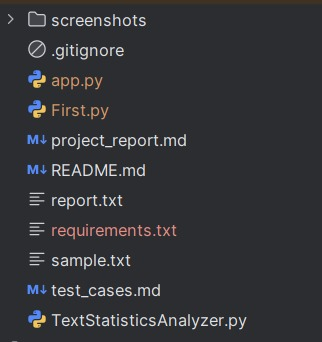
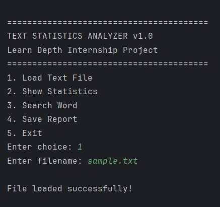
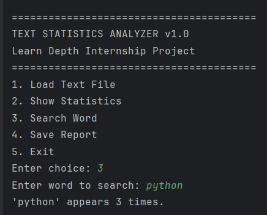
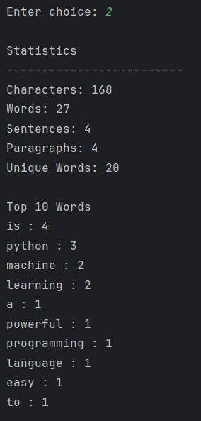
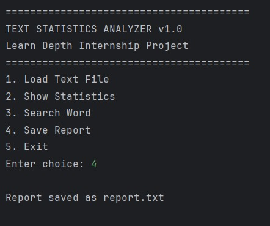

# Text Statistics Analyzer

A Python-based console application that analyzes text files and provides useful statistics such as word count, character count, line count, and word search functionality.

## Features

- Load text files
- Count words
- Count characters
- Count lines
- Search specific words
- Generate analysis report

## Technologies Used

- Python 3
- File Handling
- Object-Oriented Programming (OOP)

## Project Structure

```text
TextStatisticsAnalyzer/
│
├── TextStatisticsAnalyzer.py
├── sample.txt
├── report.txt
├── README.md
├── project_report.md
├── test_cases.md
└── screenshots/
    ├── menu.png
    ├── load_file.png
    ├── search_word.png
    ├── statistics.png
    └── save_report.png
```

## How to Run

1. Clone the repository

```bash
git clone https://github.com/PrathapCodes/TextStatisticsAnalyzer.git
```

2. Navigate to the project folder

```bash
cd TextStatisticsAnalyzer
```

3. Run the program

```bash
python TextStatisticsAnalyzer.py
```

## Test Cases

Detailed test cases are available in:

- test_cases.md

## Project Report

Detailed documentation is available in:

- project_report.md

## Screenshots

### Main Menu



### Load File



### Search Word



### Statistics



### Save Report



## Author

**Prathapa V**
